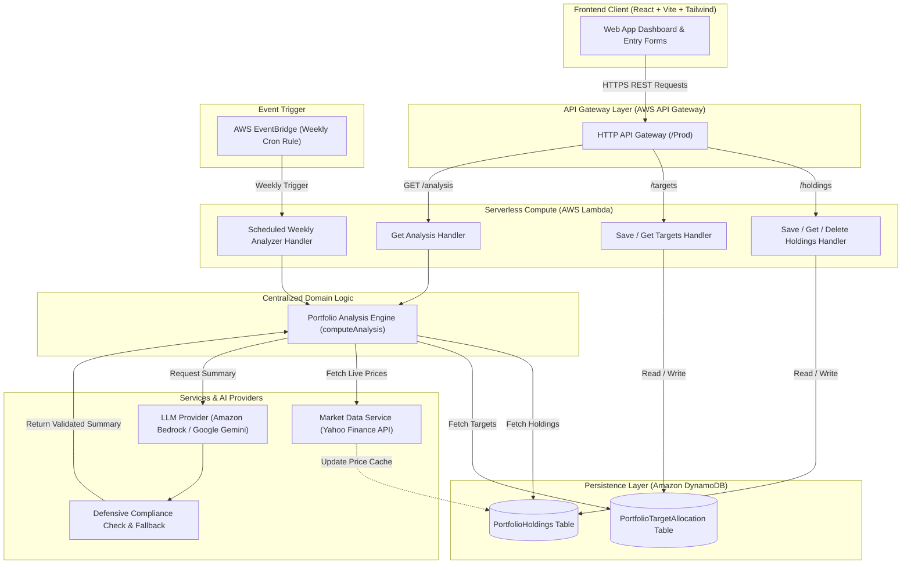

# Portfolio Health

> "Understand your portfolio before making decisions."

---

Portfolio Health is an intuitive portfolio analysis application designed for retail investors who hold stocks across different brokerages and want a clearer picture of their total financial exposure.

Most financial platforms focus almost exclusively on daily price movements and short-term profit or loss. While these numbers are useful, they rarely reveal structural portfolio risks—such as having over 60% of your capital tied up in a single stock or heavily concentrated in a single industry sector.

Portfolio Health brings clarity to your asset distribution. It calculates real-time valuation, position weights, sector exposure, concentration risk, and allocation drift, paired with plain-language AI summaries. The application does not provide stock picks, buy/sell recommendations, or financial advice—its sole focus is helping you understand what you own before making decisions.

---

## Why I Built This

When managing a personal stock portfolio, raw numbers alone don't tell the full story. Standard brokerage dashboards make it easy to see if a stock is up or down, but difficult to answer basic risk questions:
* *Is my portfolio dangerously concentrated in one or two stocks?*
* *How far has my actual sector weighting drifted from my long-term goal?*
* *What does my overall risk profile look like in plain language?*

I built Portfolio Health to bridge this gap. By combining automated financial calculations with plain-language AI explanations, the application translates raw position data into clear, readable context so investors can evaluate their portfolio health before taking action.

---

## What It Does

- **Holdings Management:** Add, edit, and remove stock positions with automatic symbol formatting and field validation.
- **Real-Time Valuation & Returns:** Calculate total market value, total invested capital, net gain/loss, and overall return percentage.
- **Concentration Risk Analysis:** Automatically evaluate top-1 and top-3 holding weights, highlighting risk levels (`low`, `moderate`, or `high`).
- **Sector Breakdown & Target Drift:** Map holdings to industry sectors, set target allocation percentages, and track drift (`actual % - target %`).
- **Plain-Language AI Insights:** Generate factual 2–4 sentence summaries of portfolio health (powered by Amazon Bedrock in production and Google Gemini in development).
- **Defensive Compliance Guardrails:** Automatically validate AI summaries against banned advisory terms (`buy`, `sell`, `hold`, etc.) and fall back to safe rule-based summaries if non-compliant.
- **Fault-Tolerant State Handling:** Keep user holdings visible even if market data APIs fail, providing inline retry actions rather than wiping the dashboard.
- **Responsive Dark Dashboard:** Purpose-built financial UI optimized for both desktop browsers and mobile screens.

---

## How It Works

1. **User Action:** The React frontend sends requests to AWS API Gateway HTTP API.
2. **Serverless Compute:** Lightweight TypeScript Lambda handlers retrieve holdings and target allocations from Amazon DynamoDB.
3. **Core Analysis Engine:** The engine queries live stock prices (falling back to DynamoDB price caches if an API lookup fails), calculates valuation, position weights, sector totals, concentration flags, and target drift.
4. **AI Generation & Verification:** The computed metrics are sent to the LLM service to generate a plain-language summary, which is verified by a defensive keyword checker before being returned to the client.

---

## System Architecture



---

## Technical Stack

| Layer | Technology | Description |
|---|---|---|
| **Frontend Framework** | React 18, TypeScript, Vite | Single Page Application with fast HMR and strict type checking. |
| **Frontend Styling** | Tailwind CSS, Lucide React | Custom dark financial UI, responsive grid/table switching, micro-animations. |
| **Infrastructure as Code** | AWS SAM (Serverless Application Model) | Infrastructure definition, local execution, and CloudFormation packaging. |
| **API Layer** | AWS API Gateway (HTTP API) | Low-latency, cost-effective HTTP API routing with CORS configuration. |
| **Compute** | AWS Lambda (Node.js 20.x, TypeScript) | Stateless, event-driven serverless functions with 256MB memory allocations. |
| **Database** | Amazon DynamoDB | Fully managed NoSQL database with On-Demand (`PAY_PER_REQUEST`) billing. |
| **AI / LLM Integration** | Amazon Bedrock / `@google/genai` | Configurable provider interface supporting Claude 3 Haiku / Gemini 2.0. |
| **Testing** | Vitest, `aws-sdk-client-mock` | Unit test runner with AWS SDK v3 client mocking. |

---

## Architectural & Engineering Decisions

### 1. Centralized & Decoupled Domain Logic
The core calculation logic (`computeAnalysis`) is strictly separated from AWS Lambda event handlers (`APIGatewayProxyEventV2`). This design ensures:
- **Reusability:** Both synchronous HTTP requests (`GET /analysis`) and asynchronous cron triggers (`ScheduledAnalyzerFunction`) invoke the exact same calculation logic without duplicate code.
- **Testability:** Domain logic can be unit-tested in isolation using mock data without bootstrapping Lambda runtime environments.

### 2. Provider Abstraction for AI Service Layer
An `LLMProvider` TypeScript interface isolates provider-specific SDK logic:
- **Development Mode:** Uses `@google/genai` (Google Gemini API) for local development and integration tests.
- **Production Mode:** Uses `@aws-sdk/client-bedrock-runtime` (`ConverseCommand`) for AWS execution.
Switching providers requires changing a single environment variable (`LLM_PROVIDER=bedrock|gemini`) without altering domain calculations.

### 3. Defensive LLM Compliance & Fallback Strategy
To guarantee non-advisory compliance, LLM output passes through a post-generation validation layer (`llmValidator.ts`):
- Checks for prohibited financial terms (`buy`, `sell`, `hold`, `recommend`, `should invest`, etc.) using word-boundary regex checks.
- Enforces strict length boundaries (2 to 4 sentences).
- If validation fails or LLM invocation errors, the system seamlessly substitutes a deterministic, rule-based fallback summary (`llmFallback.ts`).

### 4. Price Caching & Resilience Strategy
To handle third-party market data API rate limits or symbol lookup failures:
- Successful price lookups update `lastKnownPrice` and `lastFetchedAt` in DynamoDB.
- If live price lookup fails for a symbol, the system falls back to `lastKnownPrice` and flags `isPriceCached: true`.
- If an unpriced symbol is added, raw holdings remain preserved in state and an inline warning banner allows manual retry without clearing user data.

---

## API Overview

All API endpoints return JSON formatted under UTF-8. 

### Standard Error Schema
```json
{
  "error": {
    "code": "INVALID_INPUT",
    "message": "quantity must be a positive number greater than 0.",
    "details": [{ "field": "quantity", "issue": "Must be > 0" }]
  }
}
```

### Implemented Endpoints

| Endpoint | Method | Description | Request Body / Parameters |
|---|---|---|---|
| `/holdings` | `POST` | Add or update a stock position | `{ "stockSymbol": "TCS", "quantity": 10, "avgBuyPrice": 3800.50 }` |
| `/holdings` | `GET` | Retrieve raw holdings list | None |
| `/holdings/{stockSymbol}` | `DELETE` | Delete a position by symbol | Path parameter: `stockSymbol` (e.g. `/holdings/TCS`) |
| `/targets` | `POST` | Set sector target allocations | `{ "targets": [{ "category": "IT", "targetPercent": 30 }, ...] }` |
| `/targets` | `GET` | Retrieve configured target allocations | None |
| `/analysis` | `GET` | Execute full portfolio valuation & risk analysis | None |

---

## Data Model & Persistence

### DynamoDB Table Schemas

#### 1. `PortfolioHoldings` Table
- **Partition Key (PK):** `userId` (String, e.g., `"default-user"`)
- **Sort Key (SK):** `stockSymbol` (String, e.g., `"TCS"`)

| Attribute | Type | Description |
|---|---|---|
| `userId` | String | User partition identifier. |
| `stockSymbol` | String | Uppercase equity ticker symbol. |
| `quantity` | Number | Total shares owned (> 0). |
| `avgBuyPrice` | Number | Average purchase cost per share (> 0). |
| `sector` | String | Industry sector mapped from static dictionary. |
| `lastKnownPrice` | Number | Cached market price from last successful fetch. |
| `lastFetchedAt` | String | ISO 8601 timestamp of last successful price update. |
| `addedAt` / `updatedAt` | String | ISO 8601 timestamps. |

#### 2. `PortfolioTargetAllocation` Table
- **Partition Key (PK):** `userId` (String, e.g., `"default-user"`)
- **Sort Key (SK):** `category` (String, e.g., `"IT"`, `"Banking"`)

| Attribute | Type | Description |
|---|---|---|
| `userId` | String | User partition identifier. |
| `category` | String | Sector name or category classification. |
| `targetPercent` | Number | User-defined target allocation percentage (0–100). |
| `updatedAt` | String | ISO 8601 timestamp. |

### Sector Lookup Mapping
To ensure deterministic sector assignment without requiring external paid sector APIs, a static sector mapping table (`sector-mapping.json`) covers ~50 prominent Indian equities (NSE/BSE). Unrecognized tickers default to `"Other"`.

---

## Local Development Setup

### Prerequisites
- **Node.js:** v20.x or higher
- **npm:** v10.x or higher
- **AWS SAM CLI:** Optional (for local AWS Lambda testing)

### 1. Repository Setup
```bash
git clone https://github.com/VV5456/portfolio-health-diversification-tracker.git
cd portfolio-health-diversification-tracker
```

### 2. Backend Setup & Testing
```bash
cd backend
npm install

# Run backend unit test suite (Vitest)
npm test

# Build TypeScript Lambda handlers to dist/
npm run build
```

### 3. Frontend Setup & Execution
```bash
cd ../frontend
npm install

# Start Vite local development server
npm run dev

# Run TypeScript compilation & production build check
npm run build
```

---

## Environment Variables

Environment configuration is managed via standard environment variables. Refer to `.env.example` in the project root.

### Frontend (`frontend/.env`)
| Variable | Description | Default / Example |
|---|---|---|
| `VITE_API_BASE_URL` | Base URL of deployed API Gateway or local emulator | `https://5gv00gm0g4.execute-api.ap-south-1.amazonaws.com/Prod` |

### Backend (`backend/.env` & AWS SAM Globals)
| Variable | Description | Options / Example |
|---|---|---|
| `HOLDINGS_TABLE` | DynamoDB table name for holdings | `PortfolioHoldings` |
| `TARGETS_TABLE` | DynamoDB table name for targets | `PortfolioTargetAllocation` |
| `LLM_PROVIDER` | Active LLM service adapter | `bedrock` (Production) / `gemini` (Development) |
| `GEMINI_API_KEY` | API Key for Google Gemini API | Required if `LLM_PROVIDER=gemini` |
| `AWS_REGION` | Target AWS region | `ap-south-1` |

---

## Testing & Quality Assurance

### Unit Test Execution
The backend suite uses **Vitest** paired with `aws-sdk-client-mock` to test repositories, market data services, LLM adapters, validation logic, and Lambda handlers.

```bash
cd backend
npm test
```

**Current Verification Status:**
- **Backend Test Suite:** **88 / 88 tests passing** across 10 test suites (0 failures).
- **Frontend Build Check:** `tsc && vite build` compiles cleanly with **0 TypeScript or Vite bundling errors**.

### End-to-End Functional Validation
The application has undergone end-to-end verification covering:
1. **Holdings CRUD:** Adding, updating, and deleting positions dynamically.
2. **Partial Success Resilience:** Adding unpriced tickers preserves saved position data in DynamoDB and UI while presenting inline retry controls.
3. **Target Allocation Rules:** Rejecting target configurations exceeding 100% total allocation.
4. **State Persistence:** Preserving holdings and target allocations across page refreshes.

---

## Infrastructure & AWS Deployment Architecture

The AWS serverless infrastructure is specified using **AWS SAM** in `infra/template.yaml`.

```bash
# Validate SAM infrastructure specification syntax
sam validate -t infra/template.yaml

# Build serverless artifacts
sam build -t infra/template.yaml

# Deploy CloudFormation stack to AWS
sam deploy --guided
```

### Infrastructure Summary
- **API Gateway:** HTTP API configured with CORS headers (`GET`, `POST`, `DELETE`, `OPTIONS`).
- **Lambda Functions:** 6 discrete Lambda functions configured with 256MB RAM, Node.js 20.x runtime, and IAM policies scoped to specific DynamoDB table ARNs.
- **DynamoDB Tables:** Two `PAY_PER_REQUEST` tables (`PortfolioHoldings` and `PortfolioTargetAllocation`).
- **EventBridge Schedule:** A 7-day rate expression triggering `ScheduledAnalyzerFunction`.

---

## Current Limitations & Known Status

- **Bedrock Model Authorization:** The production backend code includes full Amazon Bedrock SDK integration (`@aws-sdk/client-bedrock-runtime` invoking Claude 3 Haiku) and IAM policies (`bedrock:InvokeModel`). However, actual model responses currently depend on AWS model access authorization for the target account. When Bedrock model access is unavailable, the application gracefully returns the deterministic fallback summary.
- **Single-Tenant MVP Key:** The MVP uses a default partition key (`userId = "default-user"`). Multi-tenant support can be activated by replacing the hardcoded partition key with an authenticated JWT token claim (e.g., AWS Cognito `sub`).

---

## Future Enhancements

- **User Authentication:** Integrate AWS Cognito / NextAuth for multi-user authentication.
- **Historical Snapshots:** Deploy the optional `SnapshotsTable` and render historical portfolio valuation trend lines over time.
- **Multi-Currency Support:** Support global equity tickers (US/EU exchanges) with live currency conversion.

---

## Responsible-Use Disclaimer

> **Disclaimer:** Portfolio Health is an educational and analytical tool designed solely to compute portfolio allocation metrics, sector distributions, and concentration risk. It **does not** provide investment advice, financial recommendations, or trading guidance. Users should consult a qualified financial advisor before making investment decisions.

---

## License

This project is open-source under the [MIT License](LICENSE) (or repository owner terms).
