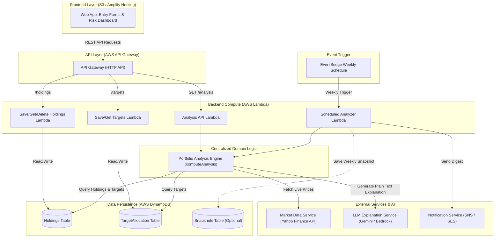

# System Architecture

## 1. Overview
The Portfolio Health & Diversification Tracker is a serverless application built on AWS that provides retail investors in India with a clear, plain-language view of their portfolio health, concentration risk, sector breakdown, and target allocation drift.

Crucially, the system is **purely descriptive**—it does not offer investment recommendations, trading execution, or financial advice.

---

## 2. High-Level Architecture Diagram

---

## 3. Component Breakdown & Responsibilities

### 3.1 Frontend Web Application
* **Role:** Single Page Application (SPA) serving as the user interface.
* **Responsibilities:**
  * Holdings Entry Form: Input stock symbol, quantity, average buy price.
  * Target Allocation Form: Input target percentages for sectors/categories.
  * Portfolio Dashboard: Visual display of total valuation, gain/loss, holdings weights, sector breakdown, concentration risk alerts, target drift table, and plain-language AI explanation.
* **Hosting:** Static website hosted on AWS S3 / AWS Amplify Hosting.

### 3.2 API Gateway Layer
* **Role:** Secure HTTP API entry point for frontend client requests.
* **Responsibilities:**
  * Route requests to corresponding Lambda handlers (`POST /holdings`, `GET /holdings`, `DELETE /holdings/{stockSymbol}`, `POST /targets`, `GET /targets`, `GET /analysis`).
  * Enable CORS support for frontend origin.
  * Input format validation and error mapping.

### 3.3 Lambda Functions Layer
* **Holdings Handler (`save-holdings`, `get-holdings`, `delete-holding`):** Executes CRUD operations against DynamoDB `Holdings` table.
* **Target Allocation Handler (`save-targets`, `get-targets`):** Executes CRUD operations against DynamoDB `TargetAllocation` table.
* **Analysis Handler (`get-analysis`):** Invoked synchronously by `GET /analysis` request; triggers the centralized analysis engine and returns structured JSON output.
* **Scheduled Analyzer Handler (`scheduled-analyzer`):** Invoked asynchronously by AWS EventBridge weekly rule; executes the centralized analysis engine and dispatches digests via SNS/SES.

### 3.4 Centralized Portfolio Analysis Engine (`computeAnalysis`)
* **Role:** Core business logic module completely decoupled from AWS Lambda handler interfaces.
* **Responsibilities:**
  1. Retrieve holdings and target allocations for `userId`.
  2. Query Market Data Service for current prices (or fallback cached price).
  3. Calculate current value (`quantity * price`) and invested value (`quantity * avgBuyPrice`).
  4. Compute individual holding weight percentages and overall portfolio gain/loss.
  5. Compute aggregated sector breakdown.
  6. Compute concentration risk (% in top 1 holding, top 3 holdings) and evaluate risk thresholds (`high` > 60%, `moderate` > 40%, `low` <= 40%).
  7. Compute target drift (`actualSector% - targetSector%`).
  8. Call LLM Explanation Service with computed portfolio facts.
  9. Run defensive keyword check on LLM response and apply safe fallback if required.
  10. Return compiled analysis payload.

### 3.5 Market Data Service
* **Role:** Isolated provider module responsible for fetching live/near-live stock prices.
* **Responsibilities:**
  * Fetch current stock prices for Indian equities (NSE/BSE).
  * Catch provider failures gracefully and fallback to `lastKnownPrice` stored in DynamoDB `Holdings`.
  * Update `lastKnownPrice` and `lastFetchedAt` timestamps in DynamoDB when live fetch succeeds.
  * Annotate returned price data with a `isCached` boolean flag.

### 3.6 LLM Explanation Service Layer
* **Role:** Isolated provider module generating factual 2–4 sentence plain-language summaries.
* **Responsibilities:**
  * System Prompt Enforcement: Strict guardrails prohibiting buy/sell recommendations, investment advice, or invented statistics.
  * Multi-provider Adapter: Uniform interface supporting **Google Gemini API** (for local development & testing) and **Amazon Bedrock** (for AWS production).
  * Defensive Validation: Post-generation keyword check scanning for banned terms (`buy`, `sell`, `recommend`, etc.) and substituting a deterministic fallback template if triggered.

### 3.7 Notification Layer (SNS / SES)
* **Role:** Dispatches periodic weekly digest summary to user via Email (SES) or SMS (SNS).

---

## 4. AWS Services Inventory

| AWS Service | Usage / Purpose | MVP Requirement |
|---|---|---|
| **AWS API Gateway** | HTTP API routes for holdings, targets, and analysis | Required |
| **AWS Lambda** | Serverless compute handlers and scheduled jobs | Required |
| **AWS DynamoDB** | NoSQL database for `Holdings`, `TargetAllocation`, `Snapshots` | Required |
| **Amazon Bedrock** | Serverless LLM inference for production plain-language explanation | Required (Prod) / Gemini (Dev) |
| **Amazon EventBridge** | Cron rule to trigger scheduled weekly portfolio digest | Optional / Task 11 |
| **Amazon SNS / SES** | Email / SMS delivery for scheduled digest | Optional / Task 11 |
| **Amazon S3 / Amplify** | Static hosting for the frontend SPA | Required |
| **AWS IAM** | Least-privilege roles for Lambdas to access DynamoDB, Bedrock, SNS | Required |
| **AWS Budgets** | Cost threshold monitoring & alerting | Required |

---

## 5. Specification Mandates vs. Proposed Implementation Decisions

### Explicitly Mandated by `portfolio-tracker-spec.md`
1. Single-user MVP model with explicit schema keys (`userId`, `stockSymbol`, `category`).
2. DynamoDB tables: `Holdings`, `TargetAllocation`, optional `Snapshots`.
3. Centralized portfolio analysis logic used by both API Gateway and EventBridge scheduled paths.
4. Static sector lookup table mapping stock symbols to sectors (~50 Indian equities).
5. External price fetching with fallback to cached `lastKnownPrice` and `lastFetchedAt` timestamps in DynamoDB.
6. Strict LLM prompt constraints (descriptive only, no investment advice, 2–4 sentences, strict banned term verification).
7. Bedrock in production with Gemini support during local development.

### Proposed Implementation Decisions
1. **Tech Stack:** Node.js 20.x runtime with TypeScript for backend Lambdas; React + Vite + TypeScript with Tailwind CSS for frontend.
2. **Architecture Pattern:** Clean / Hexagonal Layered Architecture separating HTTP Handlers (`handlers/`), Domain Logic (`engine/`), Data Access Repositories (`db/`), and External Services (`services/`).
3. **IaC / Deployment Tooling:** AWS SAM (Serverless Application Model) for infrastructure definition, local invocation, and deployment.
4. **Local Development Setup:** Local mock price provider and Gemini LLM provider fallback using `.env` variables (`LLM_PROVIDER=gemini|bedrock`, `PRICE_PROVIDER=yahoo|mock`).
