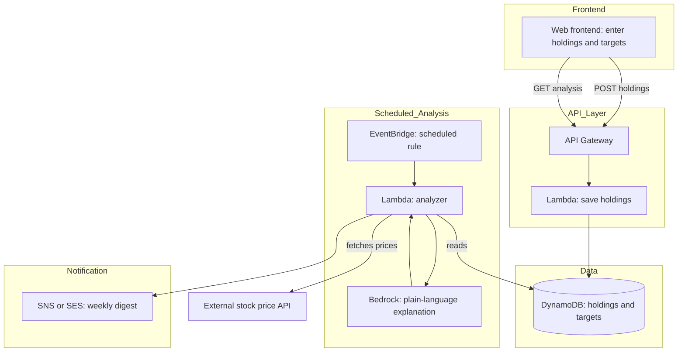

# Portfolio Health & Diversification Tracker
### Full Project Specification — Architecture, Data, Code, and Deployment

> **Purpose of this document:** This is a self-contained reference for the entire project. It is written so that any LLM (Gemini, Claude, GPT, etc.) or any human collaborator can read it cold and understand exactly what to build, why, and how the pieces connect. Paste this whole document as context when prompting an AI coding tool (e.g. Antigravity) to build or extend any part of the system.

---

## 1. Project Overview

### 1.1 One-line pitch
A tool that tells retail investors, in plain language, how healthy and diversified their portfolio actually is — without ever telling them what to buy or sell.

### 1.2 The problem
Retail investors in India frequently accumulate holdings over time without a clear view of:
- How concentrated their money is in a single stock or sector
- Whether their current allocation still matches what they originally intended
- What their real gain/loss position is across everything they hold, in one place

Existing brokerage apps show raw numbers (price, quantity, P&L) but rarely explain **what those numbers mean** for risk. A user can be 70% invested in one sector and have no idea, because no single screen adds that up and explains it.

### 1.3 The solution
Users manually enter their holdings (stock, quantity, average buy price) and, optionally, a target allocation they want to maintain. The system:
1. Pulls live prices for each holding
2. Calculates current value, gain/loss, and percentage weight of each holding
3. Flags concentration risk (single-stock and single-sector)
4. Compares current allocation to the user's target and flags drift
5. Uses an LLM to explain *why* the numbers matter, in plain language — descriptive, not advisory
6. Sends a periodic (e.g. weekly) digest so the tool has a reason to be revisited, not just a one-time report

### 1.4 What this project explicitly is NOT
This distinction matters both legally and technically — keep it in mind at every layer, especially when writing any AI-generated copy:
- **Not investment advice.** It never recommends buying, selling, or holding anything. Giving personalized investment advice in India requires SEBI registration as an Investment Adviser. This tool only **describes facts about the user's own portfolio** (e.g., "62% of your portfolio is in two stocks") and explains **general concepts** (e.g., what concentration risk means in general).
- **Not a trading platform.** No order execution, no brokerage integration required for the MVP.
- **Not a real-time trading terminal.** Price data can be near-real-time (e.g. 15-minute refresh), not tick-by-tick.

Any AI-generated text (via Bedrock or Gemini) must be reviewed against this boundary — see Section 7 (Prompting Structure) for exact constraints.

### 1.5 Target user
A retail investor in India who holds multiple stocks across one or more brokers, checks their portfolio casually, and has no single place that adds everything up and explains the risk picture in plain language.

---

## 2. Core Features

### 2.1 Must-have (MVP)
| # | Feature | Description |
|---|---------|-------------|
| 1 | Add/edit/remove holdings | Stock symbol, quantity, average buy price |
| 2 | Live valuation | Current price × quantity for each holding, fetched from a live source |
| 3 | Gain/loss view | Per-holding and total portfolio gain/loss, in currency and percent |
| 4 | Concentration analysis | % of portfolio in top holding, top 3 holdings, and by sector |
| 5 | Plain-language explanation | AI-generated 2–4 sentence summary of the portfolio's risk picture |
| 6 | Target allocation (optional) | User sets target % per sector or per holding; system shows drift |

### 2.2 Nice-to-have (cut freely if short on time)
| # | Feature | Description |
|---|---------|-------------|
| 7 | Weekly digest | Scheduled email/notification summarizing changes since last check |
| 8 | Historical snapshot | Store weekly snapshots so the user can see how concentration has changed over time |
| 9 | Visual breakdown | Pie/bar chart of allocation by holding and by sector |
| 10 | Multi-portfolio support | Track more than one portfolio (e.g. personal + family) |

### 2.3 Explicitly out of scope
- Brokerage account linking / auto-import of holdings
- Order placement or any transactional trading feature
- Tax computation (capital gains, etc.) — related but separate problem
- Multi-currency / international stock support

---

## 3. System Architecture

### 3.1 High-level architecture diagram



### 3.2 Component responsibilities

| Component | Responsibility |
|---|---|
| **Frontend (S3 / Amplify Hosting)** | Form to add/edit holdings and set target allocation; dashboard view showing valuation, concentration, and the plain-language summary; optional chart |
| **API Gateway** | HTTP entry point; routes requests to the correct Lambda |
| **Lambda: save-holdings** | Validates and writes holding records to DynamoDB |
| **Lambda: get-analysis** | On-demand read: recalculates and returns current portfolio analysis for the dashboard |
| **DynamoDB** | Stores holdings, target allocations, and (optionally) historical weekly snapshots |
| **EventBridge** | Triggers the scheduled analysis Lambda on a cadence (e.g. weekly) |
| **Lambda: analyzer** | Fetches live prices, computes valuation/concentration/drift, calls the LLM for an explanation, triggers the digest |
| **External stock price API** | Provides live/near-live price data (see Section 4.4 for provider notes) |
| **Bedrock / Gemini (LLM)** | Turns computed numbers into a plain-language explanation, constrained to description only — see Section 7 |
| **SNS / SES** | Delivers the weekly digest by email or SMS |

### 3.3 Data flow summary
1. **Write path:** User submits holdings via the frontend → API Gateway → Lambda → DynamoDB.
2. **On-demand read path:** User opens the dashboard → API Gateway → Lambda (analyzer, synchronous mode) → reads DynamoDB → fetches live prices → computes → calls LLM → returns JSON to frontend.
3. **Scheduled path:** EventBridge triggers the same analyzer Lambda on a timer → same computation → result sent via SNS/SES instead of returned to a caller.

Keeping the analyzer logic in one Lambda (called both synchronously via API Gateway and on a schedule via EventBridge) avoids duplicating the calculation logic — factor the core "compute analysis" function so both invocation paths call it.

---

## 4. Data Model

### 4.1 DynamoDB table: `Holdings`

| Attribute | Type | Notes |
|---|---|---|
| `userId` (PK) | String | Partition key. For MVP with a single user, can be a fixed value or a simple email-based ID |
| `stockSymbol` (SK) | String | Sort key, e.g. `TCS`, `INFY` |
| `quantity` | Number | Number of shares held |
| `avgBuyPrice` | Number | Average purchase price per share |
| `sector` | String | Looked up from a static sector-mapping table at write time or read time |
| `addedAt` | String (ISO date) | When the holding was first added |
| `updatedAt` | String (ISO date) | Last edit timestamp |

### 4.2 DynamoDB table: `TargetAllocation`

| Attribute | Type | Notes |
|---|---|---|
| `userId` (PK) | String | Partition key |
| `category` (SK) | String | Sector name or `TOTAL_EQUITY` / `CASH`, depending on how granular the target is |
| `targetPercent` | Number | User's intended allocation percentage for this category |

### 4.3 DynamoDB table: `Snapshots` (nice-to-have, Section 2.2 #8)

| Attribute | Type | Notes |
|---|---|---|
| `userId` (PK) | String | Partition key |
| `snapshotDate` (SK) | String (ISO date) | Sort key, enables querying a date range |
| `totalValue` | Number | Total portfolio value at snapshot time |
| `concentrationTop1Percent` | Number | % in largest holding |
| `concentrationTop3Percent` | Number | % in top 3 holdings |
| `sectorBreakdown` | Map | `{ "IT": 45.2, "Banking": 20.1, ... }` |

### 4.4 Sector mapping
For the MVP, maintain a small static lookup (JSON file bundled with the Lambda, or a DynamoDB table) mapping ~50 common Indian stock symbols to sectors. This avoids needing a paid data provider just to classify sectors. Example:
```json
{
  "TCS": "IT",
  "INFY": "IT",
  "HDFCBANK": "Banking",
  "RELIANCE": "Energy",
  "ITC": "FMCG"
}
```
Expand this list to cover whatever stocks you use in your own demo portfolio.

### 4.5 Live price data source
Use a free, no-auth-required API that wraps Yahoo Finance data for NSE/BSE symbols (found and confirmed available as of this project's planning — verify it's still live before building, since third-party free APIs can change). Cache the last successful price fetch in DynamoDB (add a `lastKnownPrice` and `lastFetchedAt` attribute to the `Holdings` table) so a temporary API failure doesn't break the dashboard — fall back to the last known price and note it's cached.

---

## 5. API Design

All endpoints are behind API Gateway, backed by Lambda, returning JSON.

### `POST /holdings`
Add or update a holding.
```json
// Request
{ "stockSymbol": "TCS", "quantity": 10, "avgBuyPrice": 3800 }

// Response
{ "status": "ok", "stockSymbol": "TCS" }
```

### `GET /holdings`
List all holdings for the user (raw, no computed analysis).
```json
// Response
{ "holdings": [ { "stockSymbol": "TCS", "quantity": 10, "avgBuyPrice": 3800, "sector": "IT" } ] }
```

### `DELETE /holdings/{stockSymbol}`
Remove a holding.

### `POST /targets`
Set a target allocation for a category.
```json
{ "category": "IT", "targetPercent": 30 }
```

### `GET /analysis`
The main dashboard endpoint. Triggers the analyzer logic synchronously and returns full computed output.
```json
{
  "totalValue": 152340,
  "totalInvested": 140000,
  "gainLossPercent": 8.8,
  "holdings": [
    {
      "stockSymbol": "TCS",
      "currentPrice": 4120,
      "currentValue": 41200,
      "weightPercent": 27.0,
      "gainLossPercent": 8.4,
      "sector": "IT"
    }
  ],
  "sectorBreakdown": { "IT": 54.0, "Banking": 22.0, "Energy": 24.0 },
  "concentration": {
    "top1Percent": 27.0,
    "top3Percent": 68.0,
    "flag": "high",
    "flagReason": "Top 3 holdings make up over two-thirds of the portfolio."
  },
  "targetDrift": [
    { "category": "IT", "target": 30, "actual": 54.0, "driftPercent": 24.0 }
  ],
  "aiSummary": "Your portfolio is heavily weighted toward IT, at 54% of total value versus your 30% target. This means..."
}
```

---

## 6. Backend Logic (Analyzer Lambda)

Pseudocode for the core `computeAnalysis(userId)` function, shared by both the on-demand and scheduled invocation paths:

```
function computeAnalysis(userId):
    holdings = readHoldings(userId)          # from DynamoDB
    targets  = readTargets(userId)           # from DynamoDB

    for each holding in holdings:
        price = fetchLivePrice(holding.stockSymbol)
        if price fetch fails:
            price = holding.lastKnownPrice   # fallback
        else:
            updateLastKnownPrice(holding.stockSymbol, price)

        holding.currentValue = price * holding.quantity
        holding.investedValue = holding.avgBuyPrice * holding.quantity
        holding.gainLossPercent = percentChange(investedValue, currentValue)

    totalValue = sum(holding.currentValue for holding in holdings)

    for each holding in holdings:
        holding.weightPercent = (holding.currentValue / totalValue) * 100

    sectorBreakdown = groupAndSum(holdings, by=sector, value=weightPercent)

    concentration = {
        top1Percent: max(holding.weightPercent),
        top3Percent: sum of top 3 weightPercents,
        flag: "high" if top3Percent > 60 else "moderate" if top3Percent > 40 else "low"
    }

    targetDrift = []
    for each target in targets:
        actual = sectorBreakdown[target.category] or 0
        drift = actual - target.targetPercent
        targetDrift.append({ category, target: target.targetPercent, actual, driftPercent: drift })

    aiSummary = callLLM(buildPrompt(holdings, sectorBreakdown, concentration, targetDrift))

    return {
        totalValue, totalInvested, gainLossPercent,
        holdings, sectorBreakdown, concentration, targetDrift, aiSummary
    }
```

### 6.1 Scheduled invocation (weekly digest)
The EventBridge-triggered Lambda calls `computeAnalysis(userId)` for each registered user, then:
1. Optionally writes a row to the `Snapshots` table
2. Formats a short digest message (reuse `aiSummary`, or generate a "what changed since last week" comparison if snapshots are implemented)
3. Sends via SNS (SMS) or SES (email)

---

## 7. Prompting Structure (for the LLM explanation layer)

> This section defines the contract for **any** LLM used to generate the plain-language explanation — whether that's Amazon Bedrock in the deployed AWS backend, or Gemini via Antigravity during development/testing. The prompt structure should stay identical regardless of which model executes it, so the behavior doesn't change if you swap providers later.

### 7.1 System-level constraints (non-negotiable)
The system prompt must always establish:
1. **Role:** "You are a plain-language portfolio explainer. You describe facts about a user's own portfolio. You do not give investment advice."
2. **Hard boundary:** Never say or imply the words "buy," "sell," "should invest," "recommend," or any action the user should take with their money. Only describe what the numbers mean and why concentration/drift matters in general terms.
3. **Tone:** Plain, calm, factual — no hype, no alarm, no jargon without explanation.
4. **Length:** 2–4 sentences. This is a summary, not an essay.
5. **Grounding:** Only reference numbers that were actually passed in. Never invent a statistic, a stock, or a sector that wasn't in the input data.

### 7.2 Input structure passed to the model
Pass the computed analysis (not raw holdings) so the model reasons over facts you've already calculated, not the fetching/math itself:
```json
{
  "totalValue": 152340,
  "gainLossPercent": 8.8,
  "sectorBreakdown": { "IT": 54.0, "Banking": 22.0, "Energy": 24.0 },
  "concentration": { "top1Percent": 27.0, "top3Percent": 68.0, "flag": "high" },
  "targetDrift": [ { "category": "IT", "target": 30, "actual": 54.0, "driftPercent": 24.0 } ]
}
```

### 7.3 Example prompt template
```
SYSTEM:
You are a plain-language portfolio explainer for a personal finance tool.
Your job is to describe what the given numbers mean in 2-4 sentences.
Rules you must follow strictly:
- Never recommend buying, selling, or holding any specific investment.
- Never use the words "buy", "sell", "should invest", or "recommend".
- Only reference numbers given to you below. Do not invent figures.
- Explain concentration or drift in terms of what it means for risk in general,
  not what the user should do about it.
- Keep it to 2-4 sentences, plain language, no jargon without a one-clause explanation.

USER:
Here is a user's portfolio analysis:
{{analysis_json}}

Write the explanation now.
```

### 7.4 Post-generation validation (defensive layer)
Since LLMs can drift from instructions, add a simple keyword check on the output before sending it to the user:
```
banned_terms = ["you should buy", "you should sell", "i recommend", "consider selling", "consider buying"]
if any(term in aiSummary.lower() for term in banned_terms):
    aiSummary = fallback_template(analysis)   # a hardcoded, safe templated sentence
```
This is cheap insurance against an edge-case bad generation showing up live during your demo.

### 7.5 Using Gemini via Antigravity during development
Since you're building with Antigravity (Gemini), use the exact same system prompt and input structure above when prototyping the explanation feature locally — this keeps behavior consistent when you later wire it to Bedrock in the deployed AWS version, and means you can test prompt quality quickly with unlimited Gemini calls before touching AWS at all.

---

## 8. Frontend

### 8.1 Pages/views
1. **Holdings entry form** — add/edit/remove a holding (symbol, quantity, avg buy price)
2. **Target allocation form** — optional, set target % per sector
3. **Dashboard** — the main view:
   - Total value, total invested, overall gain/loss
   - Table of holdings with current value, weight %, gain/loss %
   - Sector breakdown (table or simple chart)
   - Concentration flag with the AI-generated explanation shown prominently
   - Target drift table (if targets are set)

### 8.2 Suggested stack
Keep it simple for a solo weekend build: plain HTML/CSS/JS calling the API Gateway endpoints directly, hosted on S3 (or Amplify Hosting if you want CI/CD from a git repo). A charting library (e.g. Chart.js via CDN) is enough for the optional pie/bar chart — no need for a full frontend framework unless you're already comfortable with one.

---

## 9. AWS Setup Checklist

1. **IAM:** Create a dedicated IAM role for the Lambdas with least-privilege access (DynamoDB read/write on the specific tables, Bedrock invoke permission, SNS/SES publish permission). Never use root credentials.
2. **DynamoDB:** Create the `Holdings`, `TargetAllocation`, and (optionally) `Snapshots` tables as described in Section 4.
3. **Lambda:** Create `save-holdings`, `get-holdings`, `delete-holding`, `save-target`, and `analyzer` functions.
4. **API Gateway:** Create a REST or HTTP API, wire each route to its Lambda.
5. **EventBridge:** Create a scheduled rule (e.g. `rate(7 days)` or a cron expression) targeting the `analyzer` Lambda in scheduled mode.
6. **Bedrock:** Enable model access for the model you plan to use (e.g. a Claude or Titan model available in your region) in the Bedrock console before your Lambda tries to invoke it.
7. **SNS/SES:** Set up a topic (SNS) or verified sender/recipient (SES, since it starts in sandbox mode) for the digest.
8. **S3/Amplify:** Host the static frontend; if using S3, enable static website hosting on the bucket.
9. **Billing:** Set a budget alert in AWS Budgets before you start — cheap insurance against runaway costs during testing.

---

## 10. Cost Awareness
This project is designed to run within free-tier limits for a hackathon demo:
- Lambda, API Gateway, DynamoDB, EventBridge, SNS all have generous free tiers at hackathon-scale usage.
- Bedrock is pay-per-token but at a handful of calls during development and a single demo, cost is negligible — check current pricing for your chosen model before heavy testing.
- SES sandbox mode is free but limited to verified email addresses — fine for a demo where you're emailing yourself.

---

## 11. Testing & Demo Plan
1. Add 4–5 real or realistic holdings covering at least 2–3 sectors, so concentration and sector breakdown have something meaningful to show.
2. Set a target allocation that deliberately differs from your actual holdings, so the drift feature has something to flag on camera.
3. Walk through the dashboard live: show valuation, show the concentration flag, show the AI explanation, show target drift.
4. If demoing the weekly digest, either trigger the EventBridge rule manually (via the console "Test" button) or show the email/SMS you received from an earlier scheduled run.
5. Record your 3-minute demo video: problem → solution → live walkthrough → what you learned (name the specific AWS services and what was new to you).

---

## 12. Judging Criteria Alignment (for your own reference)
- **Idea & impact:** Solves a real, narrow, well-understood problem (portfolio blindness), stays honest about not giving advice.
- **Built on AWS:** Uses Lambda, API Gateway, DynamoDB, EventBridge, Bedrock, SNS/SES, S3/Amplify — meaningfully, not just for show.
- **Learning:** Name explicitly, in your demo, what was new to you — likely candidates: DynamoDB schema design, EventBridge scheduling, Bedrock prompt constraints, or the free stock price API integration.
- **Execution:** A working end-to-end flow (add holdings → see analysis → get a digest) beats a partially-built flashier idea.

---

## 13. Glossary (for LLM context continuity)
- **Concentration risk:** The risk that a portfolio's outcome is overly dependent on a small number of holdings or one sector.
- **Drift:** The difference between a portfolio's current allocation and a previously set target allocation.
- **Weight (%):** A holding's current value as a percentage of total portfolio value.
- **Sector breakdown:** Portfolio value grouped by industry sector rather than by individual stock.
- **Snapshot:** A stored record of the portfolio's analysis at a point in time, used to compare change over time.

---

## 14. Future Enhancements (post-hackathon, not required for MVP)
- Brokerage API integration to auto-import holdings instead of manual entry
- Multi-user auth via Cognito
- Historical trend charts using the `Snapshots` table
- Support for mutual funds and other asset types, not just individual stocks
- Localized (regional language) explanations, reusing patterns from the LLM prompting layer in Section 7
